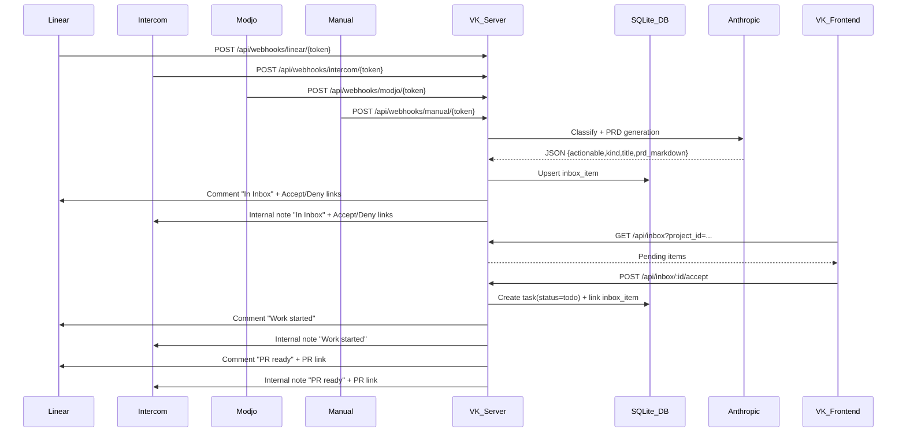
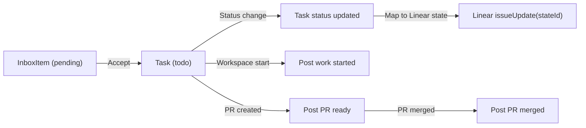

# Inbox Integrations (Linear, Intercom, Modjo, Manual)

This document captures how the Inbox is implemented and how to configure it per project.

## Overview

### Data Flow (Mermaid)



### Status Sync (Mermaid)



The Inbox aggregates incoming work from Linear, Intercom, Modjo, PostHog, Sentry, and a generic manual webhook. Items are classified and turned into a PRD-style description for a coding LLM. Users can Accept or Decline each item.

- Accept creates a Vibe Kanban task (status `todo`) and optionally creates/links a Linear issue.
- Decline marks the item as declined and it will not reappear.
- Linear issues in Backlog are ingested.
- Intercom/Modjo/PostHog/Sentry items are ingested only when the LLM classifies them as actionable bugs/features.
- Outbound updates are posted back to Linear/Intercom at key milestones (registered, started, PR ready, PR merged).

## Data model

SQLite tables and Rust models:

- `project_integrations`: per-project secrets and Linear state mapping
- `inbox_items`: normalized incoming items, PRD, source linkage, outbound markers
- `inbox_source_cursors`: cursors for polling (Modjo)

Models in:

- `crates/db/src/models/project_integrations.rs`
- `crates/db/src/models/inbox_item.rs`
- `crates/db/src/models/inbox_source_cursor.rs`

Migration:

- `crates/db/migrations/20260118000001_add_inbox_and_integrations.sql`

## Project settings (Integrations)

UI: `frontend/src/pages/settings/ProjectSettings.tsx`

Per project you can set:

- Linear: API key, team ID, webhook secret, workflow state mapping
- Intercom: access token, admin ID, webhook secret (internal notes)
- Modjo: API key, webhook secret
- PostHog: webhook secret
- Sentry: webhook secret
- PostHog enrichment: API key, host, project id
- Sentry enrichment: API token, org slug, project slug

Webhook URLs are shown in the UI when `VK_PUBLIC_BASE_URL` is set.

Linear workflow mapping:

Map each Vibe status to a Linear workflow state:

- `todo` -> `linear_state_id_todo`
- `inprogress` -> `linear_state_id_inprogress`
- `inreview` -> `linear_state_id_inreview`
- `done` -> `linear_state_id_done`
- `cancelled` -> `linear_state_id_cancelled`

Linear state metadata endpoints:

- `GET /api/projects/:projectId/integrations/linear/teams`
- `GET /api/projects/:projectId/integrations/linear/states?team_id=...`

Backend routes: `crates/server/src/routes/project_integrations.rs`

## Inbox API

Routes: `crates/server/src/routes/inbox.rs`

- `GET /api/inbox?project_id=...&status=pending`
- `GET /api/inbox/:id`
- `POST /api/inbox` (manual UI create)
- `POST /api/inbox/:id/accept`
- `POST /api/inbox/:id/decline`
- `GET /api/inbox/action/:token/accept` (one-click)
- `GET /api/inbox/action/:token/decline` (one-click)

### Manual item via REST API

Use this endpoint to create a manual inbox item (source=`manual`) directly:

- `POST /api/inbox`

Example:

```bash
curl -X POST http://localhost:3000/api/inbox \
  -H "Content-Type: application/json" \
  -d '{
    "project_id": "YOUR_PROJECT_UUID",
    "title": "Customer requested CSV export",
    "body": "Add a CSV export to the reports page with filters and timezone support.",
    "source_url": "https://your-system.example.com/items/123"
  }'
```

Notes:

- `project_id`, `title`, and `body` are required.
- `source_url` is optional and used for context links.

Accept flow:

1. Create Vibe task with status `todo`.
2. If source is not Linear and no `linear_issue_id`, create a Linear issue with a link to the VK task.
3. Link task + Linear issue on the inbox item.

Decline flow:

- Set status to `declined` (Linear will not re-ingest the same issue).

## Webhooks

Routes: `crates/server/src/routes/webhooks.rs`

- `POST /api/webhooks/linear/:project_webhook_token`
- `POST /api/webhooks/intercom/:project_webhook_token`
- `POST /api/webhooks/modjo/:project_webhook_token`
- `POST /api/webhooks/manual/:project_webhook_token`
- `POST /api/webhooks/posthog/:project_webhook_token`
- `POST /api/webhooks/sentry/:project_webhook_token`

Security:

- Project token in the URL path
- HMAC signatures when provider supplies them

Signature headers:

- PostHog: `X-Posthog-Signature`
- Sentry: `Sentry-Hook-Signature`

Manual payload:

```json
{
  "source_item_id": "external-id",
  "title": "Short title",
  "body": "Full description",
  "source_url": "https://...",
  "kind": "bug|feature|other",
  "force_pending": true
}
```

## LLM classification

Service: `crates/services/src/services/anthropic.rs`

Environment:

- `VK_ANTHROPIC_API_KEY`
- `VK_ANTHROPIC_MODEL` (default: `claude-3-5-sonnet-latest`)

Contract (returned JSON):

```json
{
  "actionable": true,
  "kind": "bug|feature|other",
  "title": "Short title",
  "prd_markdown": "LLM-ready description",
  "context_links": ["https://..."]
}
```

## Outbound updates back to Linear/Intercom

Service: `crates/services/src/services/inbox_outbound.rs`

Posted milestones:

- **Registered**: item entered inbox (includes Accept/Deny links)
- **Started**: workspace/attempt starts
- **PR ready**: PR created/attached
- **PR merged**: PR monitor detects merge

Hook points:

- Registered: webhook handlers (Linear/Intercom)
- Started: `routes/task_attempts.rs` and `routes/tasks.rs`
- PR ready: `routes/task_attempts/pr.rs`
- PR merged: `services/pr_monitor.rs`

## Linear sync

- When a non-Linear item is accepted, a Linear issue is created.
- Task status changes update Linear workflow state.

Sync points:

- `routes/tasks.rs` (UI updates)
- `services/pr_monitor.rs` (auto-done on merge)

Integration helper: `crates/services/src/services/inbox_integrations.rs`

## Frontend UI

- Inbox page: `frontend/src/pages/ProjectInbox.tsx`
- Navigation:
  - Project details: Inbox button in `frontend/src/components/projects/ProjectDetail.tsx`
  - Route: `/projects/:projectId/inbox`

## Environment variables

- `VK_PUBLIC_BASE_URL` (used for webhook URLs + action links)
- `VK_ANTHROPIC_API_KEY`
- `VK_ANTHROPIC_MODEL`

## PostHog + Sentry enrichment

When PostHog/Sentry API credentials are configured, the webhook handler fetches
additional context and includes it in the PRD prompt.

PostHog enrichment:

- API: `GET {host}/api/projects/{project_id}/events/{event_id}`
- Required: API key, host, project id

Sentry enrichment:

- API: `GET https://sentry.io/api/0/issues/{issue_id}/`
- Latest event: `GET https://sentry.io/api/0/projects/{org}/{project}/issues/{issue_id}/events/latest/`
- Required: API token, org slug, project slug

## Known limitations / TODOs

- Modjo poller is scaffolded but does not fetch/ingest yet.
- Linear/Intercom webhook payload parsing is resilient but minimal; extend if needed.

## Recommended payload IDs

To maximize enrichment quality:

- PostHog webhook payload should include the event `uuid` (used for API lookup).
- Sentry webhook payload should include the issue `id` (used for API lookup).

If these IDs are missing, enrichment falls back to the webhook payload only.