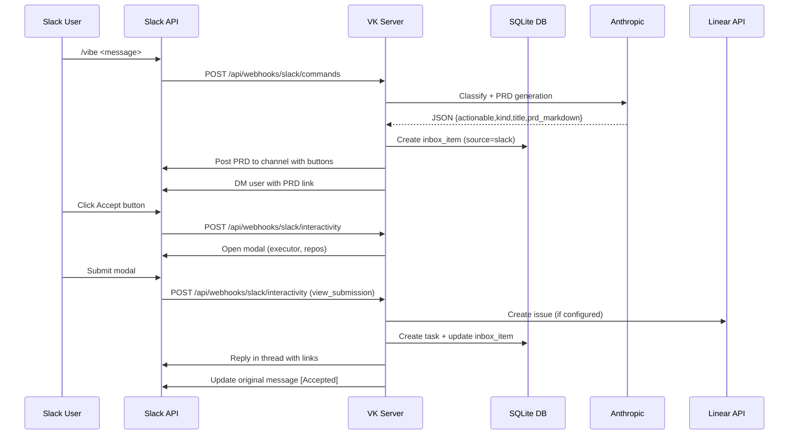
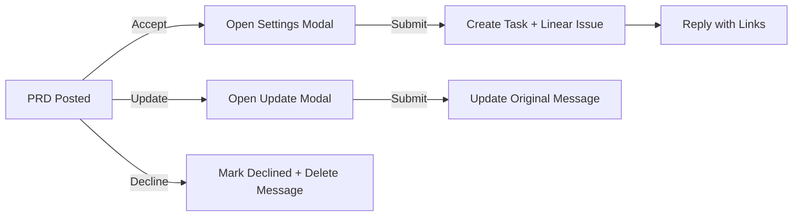

# Slack Integration

This document describes the Slack integration for managing PRDs and tasks directly from Slack.

## Overview

### Data Flow (Mermaid)



### Button Flow (Mermaid)



The Slack integration provides an alternative workflow to the Inbox UI. Instead of managing PRDs in the web interface, users interact directly in Slack:

- PRDs are posted to a configured Slack channel with Accept/Update/Decline buttons
- Users can create PRDs via the `/vibe` slash command
- Accepting opens a modal to configure: agent, configuration variant, and base branch
- Branches are dynamically populated from the project's configured repositories
- On accept: creates a Vibe Kanban task, starts the coding agent, and optionally creates a Linear issue
- Thread replies include agent info, branch, and links to Linear and Vibe Kanban
- Channel message is posted tagging the user who accepted with a link to the task
- When a task is marked Done or Cancelled, a notification is posted to both the thread and channel

**Important**: Slack-managed items are hidden from the Inbox UI (filtered by `slack_message_ts IS NOT NULL`).

## Data Model

### Database Columns

**project_integrations** (added columns):
- `slack_bot_token` - Bot User OAuth Token (xoxb-...)
- `slack_signing_secret` - Used to verify Slack webhook signatures
- `slack_channel_id` - Channel ID where PRDs are posted

**inbox_items** (added columns):
- `slack_channel_id` - Channel where the PRD message was posted
- `slack_message_ts` - Slack message timestamp (used as message ID)
- `slack_accepted_by_user_id` - Slack user ID who accepted the PRD
- `source` enum now includes `slack` variant

Models in:
- `crates/db/src/models/project_integrations.rs`
- `crates/db/src/models/inbox_item.rs`

Migration:
- `crates/db/migrations/20260119000001_add_slack_integration.sql`

## Project Settings

UI: `frontend/src/pages/settings/ProjectSettings.tsx`

Per project you can configure:

- **Bot Token**: Bot User OAuth Token from your Slack app
- **Signing Secret**: Used to verify webhook requests from Slack
- **Channel ID**: Channel where PRDs will be posted (right-click channel → View channel details → Copy ID)

### Required Bot Scopes

When creating your Slack app, add these OAuth scopes:

| Scope | Purpose |
|-------|---------|
| `chat:write` | Post messages to channels |
| `chat:write.public` | Post to public channels without joining |
| `commands` | Handle slash commands |
| `im:write` | Send direct messages to users |

### Slack App Configuration

1. Create a new Slack app at https://api.slack.com/apps
2. Add the required bot scopes under **OAuth & Permissions**
3. Install the app to your workspace
4. Copy the **Bot User OAuth Token** (starts with `xoxb-`)
5. Copy the **Signing Secret** from **Basic Information**
6. Configure webhook URLs:
   - **Slash Commands**: Add `/vibe` command pointing to your Slash Command URL
   - **Interactivity**: Enable and set Request URL to your Interactivity URL

## Webhook Endpoints

Routes: `crates/server/src/routes/webhooks.rs`

### Slash Commands

`POST /api/webhooks/slack/commands`

Handles the `/vibe <message>` slash command:

1. Verifies Slack signature (HMAC SHA256)
2. Finds project by configured `slack_channel_id`
3. **Responds immediately** with acknowledgment (Slack requires response within 3 seconds)
4. **Asynchronously** processes the command:
   - Generates PRD via Anthropic LLM
   - Creates `inbox_item` with `source=slack`
   - Posts PRD to channel with Accept/Update/Decline buttons
   - DMs the user with a link to the PRD

**Note**: The immediate response is ephemeral (only visible to the user who ran the command). The full PRD message is posted to the channel once processing completes.

### Interactivity

`POST /api/webhooks/slack/interactivity`

Handles button clicks and modal submissions:

**Block Actions** (button clicks):
- `accept_prd` - Opens the accept modal
- `update_prd` - Opens the update modal
- `decline_prd` - Marks item declined, updates message

**View Submissions** (modal submits):
- `accept_prd_modal` - Creates task + Linear issue, posts reply
- `update_prd_modal` - Updates PRD content, updates message

## Slack Service

Service: `crates/services/src/services/slack.rs`

### Signature Verification

```rust
pub fn verify_slack_signature(
    signing_secret: &str,
    timestamp: &str,
    body: &[u8],
    signature: &str,
) -> bool
```

Verifies `X-Slack-Signature` header using HMAC SHA256.

### SlackClient

```rust
impl SlackClient {
    pub fn new(bot_token: &str) -> Self;
    pub async fn post_message(&self, channel: &str, text: &str, blocks: Vec<SlackBlock>) -> Result<SlackPostMessageResponse>;
    pub async fn update_message(&self, channel: &str, ts: &str, text: &str, blocks: Vec<SlackBlock>) -> Result<()>;
    pub async fn views_open(&self, trigger_id: &str, view: SlackView) -> Result<()>;
    pub async fn views_open_json(&self, trigger_id: &str, view: serde_json::Value) -> Result<()>;
    pub async fn open_dm(&self, user_id: &str) -> Result<String>;
    pub async fn send_dm(&self, user_id: &str, text: &str, blocks: Vec<SlackBlock>) -> Result<()>;
}
```

### Helper Functions

- `build_prd_blocks_json(title, prd_markdown, inbox_item_id, status)` - Builds PRD message blocks with buttons
- `build_accept_modal_json(inbox_item_id, branches)` - Builds the accept settings modal with dynamic branch options
- `build_update_modal_view_json(inbox_item_id, title, prd)` - Builds the update modal as JSON

## Provider Webhooks → Slack

When provider webhooks (Intercom, PostHog, Sentry, Manual, Modjo) receive items, they:

1. Generate PRD via LLM
2. Create/update `inbox_item`
3. **Post to Slack** if `slack_bot_token` and `slack_channel_id` are configured
4. Store `slack_channel_id` and `slack_message_ts` on the inbox item

**Linear webhook is excluded** - Linear backlog items only go to the Inbox UI, not Slack.

Helper function: `post_prd_to_slack_if_configured()`

## Accept Flow

When a user clicks Accept, a modal opens with the following options:

### Accept Modal Fields

| Field | Type | Description |
|-------|------|-------------|
| **Agent** | Dropdown | Select the coding agent (Claude Code, Codex, Cursor Agent, Gemini, Amp, Copilot, Droid, OpenCode, Qwen Code) |
| **Configuration** | Dropdown | Agent variant (Default, Approvals, Plan, Opus, High, Max, Flash, Pro) |
| **Base Branch** | Dropdown | Git branch to base the work on (dynamically populated from project repos) |

**Note**: Not all configurations work with all agents (e.g., OPUS only works with Claude Code, FLASH only with Gemini). Invalid combinations fall back to the agent's default.

### Accept Modal Submission

When the user submits the modal:

1. Parse modal state (agent, configuration, base branch)
2. Create Linear issue (if Linear configured and source is not Linear)
3. Create Vibe Kanban task with status `todo`
4. Create workspace with selected branch for all project repos
5. Start coding agent with selected executor profile
6. Update inbox item: `status=accepted`, `task_id`, `linear_issue_id`, `linear_issue_url`
7. Store the Slack user ID who accepted in `slack_accepted_by_user_id`
8. Post channel message tagging the user who accepted with links to Vibe Kanban and Linear
9. Update original message to show `[Accepted]` status

## Update Flow

When a user clicks Update and submits the modal:

1. Extract new title and PRD content from modal
2. Update inbox item in database
3. Replace original Slack message with updated content

## Decline Flow

When a user clicks Decline:

1. Update inbox item status to `declined`
2. Delete the Slack message from the channel

## Task Status Notifications

When a task status changes, Slack notifications are posted:

**Done:**
- Thread reply + channel message: `:white_check_mark: Task completed: *PRD Title*` with links to Vibe Kanban and Linear

**Cancelled:**
- Thread reply + channel message: `:x: Task cancelled: *PRD Title*`

**Failed (execution failed):**
- Thread reply + channel message: `:warning: Task failed: *PRD Title*` tagging the user who accepted, with links to Vibe Kanban and Linear

This allows the team to see task progress without needing to check the Vibe Kanban UI.

## Environment Variables

- `VK_PUBLIC_BASE_URL` - Base URL for webhook endpoints (required for Slack URLs to work)
- `VK_ANTHROPIC_API_KEY` - For PRD generation
- `VK_ANTHROPIC_MODEL` - Model for PRD generation (default: claude-3-5-sonnet-latest)

## Inbox UI Filtering

Slack-managed items are hidden from the Inbox UI to prevent duplicate management:

```sql
-- In list_by_project and list_by_project_and_status queries
WHERE ... AND slack_message_ts IS NULL
```

This ensures items managed via Slack don't appear in the web Inbox.

## Known Limitations / TODOs

- Slack modal text inputs have a 3000 character limit; PRDs are truncated for the update modal
- Branch dropdown is limited to 100 branches (Slack's static_select limit); branch names truncated to 75 chars
- Not all agent/configuration combinations are valid; invalid combinations fall back to agent defaults
- No support for editing PRD title separately from content in Slack (combined in update modal)
- No Ralph mode support from Slack (use the web UI for autonomous iteration mode)

## Testing

1. Configure Slack app with required scopes
2. Set `VK_PUBLIC_BASE_URL` to a publicly accessible URL (use ngrok for local dev)
3. Add bot token, signing secret, and channel ID in Project Settings
4. Configure slash command and interactivity URLs in Slack app
5. Use `/vibe Test PRD for new feature` in the configured channel
6. Verify PRD appears with buttons and DM is received
